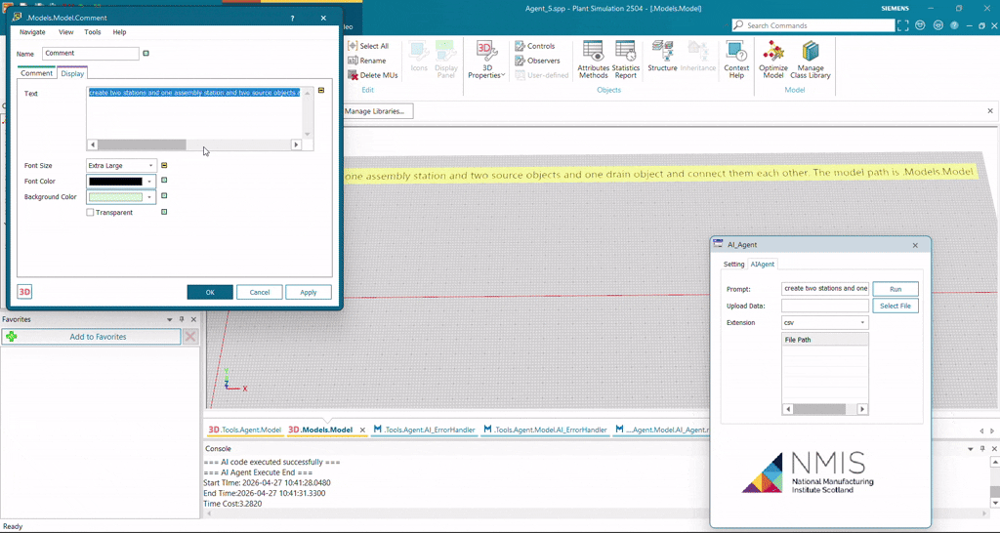
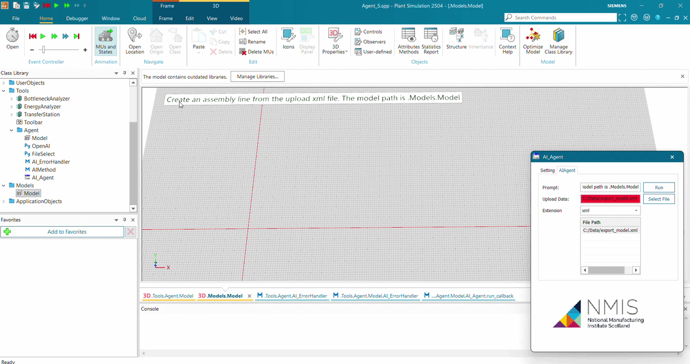

# 🌿 Plant Simulation AI Agent

An intelligent embedded agent that automates the generation of Siemens Plant Simulation models using LLMs.

## 🚀 Overview
This tool bridges the gap between natural language and discrete event simulation. By simply describing your layout, the AI agent handles object creation and routing within your model.

---

## 📋 Prerequisites
Before you start, ensure your environment meets these requirements:

> [!IMPORTANT]
> - **Python 3.10+** (System-level installation)
> - **Tecnomatix Plant Simulation** (Professional License required)
> - **OpenRouter API Key** for LLM access
> - **Dependencies**: Run `pip install -r requirements.txt`

---

## 🛠️ Getting Started
1. **Prepare Model**: Open a new blank `.Models.Model` part.
2. **AI Agent setup**: 
   * Drag and drop the `tool.psobj` file into your model.
   * Create a empty Model under Agent folder
   * Drag AI_Agent dialog, OpenAI python model, FileSelect Python model, AI_ErrorHandler Method, AIMethod Method and FileList into the empty model
   * Then invoke the dialog by 'Show Dialog' popup menu
3. **Configure**: Open the `AI_Agent` dialog and paste your **OpenRouter API Key**.
4. **Select Model**: Choose your preferred AI model (e.g., GPT-4 or Claude 3) from the dropdown.
5. **Prompt & Run**: Enter your simulation requirements and click **Run**.

---

## 💡 Example Showcases

### 1. Basic Assembly Line
**Prompt:** *"Create two sources, two stations, one assembly station, and a drain. Connect them in sequence at `.Models.Model`."*

---

### 2. Image-to-Model (Vision)
**Prompt:** *"Replicate the assembly line in the attached image, but add one extra pre-process station to each branch."*

| Input Reference | Resulting Animation |
| :--- | :--- |
| `factory.jpg` |  |

---

### 3. XML Data Integration
**Prompt:** *"Generate the assembly line architecture based on the uploaded XML configuration."*

---

## 📽️ Video Demos
If the GIFs above do not load, you can find high-resolution MP4 recordings in the [Example Folder](./Example/).
